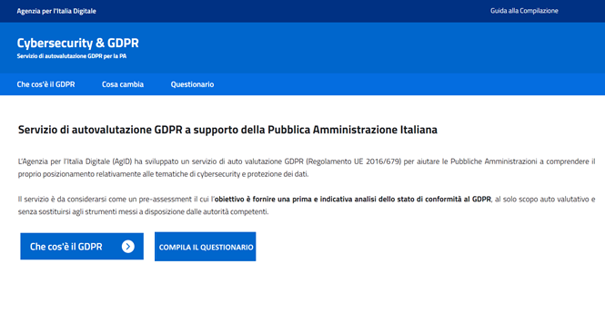
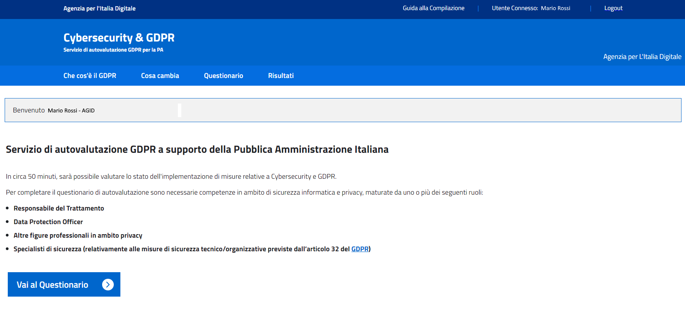
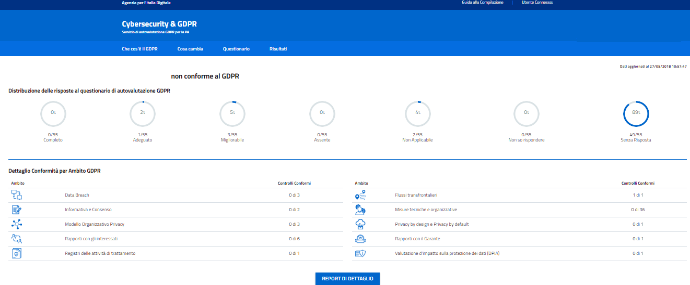

Pre-assessment GDPR - (General Data Protection Regulation)
==========================================================

**Guida all’accesso, alla registrazione e alla compilazione del questionario**

Versione 2.0 del 27 giugno 2018

Premessa
--------

Il Regolamento Generale sulla Protezione dei Dati, RGPD (in inglese
General Data Protection Regulation, GDPR), in vigore dal 24 maggio 2016
e in applicazione a decorrere dallo scorso 25 maggio 2018, è il
Regolamento (UE) 2016/679 del Parlamento europeo e del Consiglio del 27
aprile 2016 relativo alla protezione delle persone fisiche con riguardo
al trattamento dei dati personali nonché alla libera circolazione di
tali dati.

Il Regolamento è destinato a influenzare significativamente tutti i
settori pubblici e privati.

Il GDPR si applica innanzitutto a tutte le organizzazioni istituite
nell’Unione Europea, pertanto anche a tutte le Pubbliche Amministrazione
italiane.

Inoltre, il regolamento si applica anche a tutte le organizzazioni
stabilite fuori dall’Unione Europea ma che offrono beni e servizi a
cittadini europei.

Il servizio è da considerarsi come un pre-assessment il cui
l’**obiettivo è fornire una prima e indicativa analisi dello stato di
conformità al GDPR**, al solo scopo auto valutativo e senza sostituirsi
agli strumenti messi a disposizione dalle autorità competenti.

Modalità di esecuzione
-----------------------

Per l’autovalutazione in merito all’adempimento degli obblighi
introdotti dal Regolamento, AGID ha implementato una procedura
informatica assistita, il “Questionario di Autovalutazione” (di seguito
semplicemente “Questionario”).

Il processo che ogni Amministrazione potrà seguire è il seguente:

1. L’Amministrazione effettua la registrazione tramite SPID cliccando il
   pulsante “*Compila il questionario*”.
2. Dopo aver selezionato l’Identity Provider di SPID, si aprirà una
   finestra per inserire il nome utente e password di SPID;
3. L’Amministrazione accede alla pagina iniziale del link e viene
   reindirizzata alla pagina iniziale, dove cliccando sul pulsante
   “*Vai al Questionario*” oppure alla voce di menu in alto a
   destra “*Questionario*” si accede alla pagina di compilazione
   del servizio di autovalutazione.

Durante la compilazione è possibile entrare/uscire dal questionario;

Nel caso di compilazione parziale o completa del questionario,
nella pagina iniziale è presente il menu in alto a destra
“*Risultati*”, accedendo l’Amministrazione vede il risultato del
Questionario.

I dati del Questionario potranno essere modificati ed il risultato
varierà in base alle modifiche apportate.

   Home screen del questionario di autovalutazione GDPR

   Home screen da loggati al questionario di autovalutazione GDPR

OBIETTIVO DEL QUESTIONARIO DI AUTOVALUTAZIONE
---------------------------------------------

Usufruendo del servizio, in circa 50 minuti, la PA sarà in grado di
verificare lo stato di avanzamento relativo agli adempimenti previsti
dal Regolamento europeo e l’adeguatezza delle misure adottate per
garantire la sicurezza informatica.

Il servizio è da considerarsi come un *pre-assessment*, il cui
l’obiettivo è fornire una prima e indicativa analisi dello stato di
conformità della singola Amministrazione al GDPR in particolare agli
obblighi inerenti alla sicurezza informatica dei dati personali, al solo
scopo auto valutativo e senza sostituirsi agli strumenti messi a
disposizione dalle Autorità competenti.

Per completare il questionario di autovalutazione sono necessarie
competenze nell’ambito della sicurezza informatica e della tutela della
privacy, maturate da uno o più dei seguenti ruoli:

- Titolare del trattamento.
- Responsabile del trattamento.
- Responsabile della protezione dei dati.

Compilazione del questionario
-----------------------------

Le domande del Questionario sono suddivise in 10 ambiti, che
rappresentano le aree principali del GDPR che ogni Pubblica
Amministrazione è tenuta ad indirizzare. Di seguito la tabella
contenente la descrizione di ciascun ambito e gli articoli GDPR di
riferimento:

.. table:: Gli ambiti del GDPR.
  :name: ambiti GDPR

   Gli ambiti del GDPR

   +-----------------------+-----------------------+-----------------------+
   | **AMBITO GDPR**       | **DESCRIZIONE**       | **ARTICOLO DI         |
   |                       |                       | RIFERIMENTO**         |
   +=======================+=======================+=======================+
   | **Registri delle      | Implementazione dei   | Articolo 30           |
   | attività di           | registri delle        |                       |
   | trattamento**         | attività di           |                       |
   |                       | trattamento           |                       |
   |                       | contenenti le         |                       |
   |                       | informazioni relative |                       |
   |                       | ai trattamenti quali  |                       |
   |                       | ad esempio le         |                       |
   |                       | finalità, le          |                       |
   |                       | categorie di          |                       |
   |                       | interessati e di dati |                       |
   |                       | trattati.             |                       |
   +-----------------------+-----------------------+-----------------------+
   | **Modello             | Definizione di un     | Articolo 24, 26, 28,  |
   | Organizzativo         | modello organizzativo | 37, 38, 39            |
   | Privacy**             | che attribuisca ruoli |                       |
   |                       | e responsabilità in   |                       |
   |                       | ambito privacy a      |                       |
   |                       | ciascun soggetto, al  |                       |
   |                       | fine di garantire un  |                       |
   |                       | adeguato trattamento  |                       |
   |                       | dei dati.             |                       |
   +-----------------------+-----------------------+-----------------------+
   | **Informativa e       | Analisi delle         | Articolo 7, 13, 14    |
   | Consenso**            | informative privacy e |                       |
   |                       | dei consensi          |                       |
   |                       | esistenti e           |                       |
   |                       | aggiornamento con le  |                       |
   |                       | informazioni          |                       |
   |                       | obbligatorie e        |                       |
   |                       | prescrizioni del      |                       |
   |                       | GDPR.                 |                       |
   +-----------------------+-----------------------+-----------------------+
   | **Flussi              | Valutazione della     | Articolo 3, 44, 45,   |
   | transfrontalieri**    | legittimità dei       | 46, 48, 49            |
   |                       | trasferimenti di dati |                       |
   |                       | personali presso      |                       |
   |                       | paesi terzi o         |                       |
   |                       | organizzazioni        |                       |
   |                       | internazionali in     |                       |
   |                       | funzione del livello  |                       |
   |                       | di sicurezza          |                       |
   |                       | garantito.            |                       |
   +-----------------------+-----------------------+-----------------------+
   | **Rapporti con gli    | Definizione delle     | Articolo 13, 14, 15,  |
   | interessati**         | modalità operative    | 16, 17, 18, 19, 20,   |
   |                       | per l'interazione con | 21, 22                |
   |                       | gli interessati       |                       |
   |                       | (accesso,             |                       |
   |                       | portabilità,          |                       |
   |                       | rettifica,            |                       |
   |                       | cancellazione,        |                       |
   |                       | limitazione,          |                       |
   |                       | opposizione,          |                       |
   |                       | notifica,             |                       |
   |                       | comunicazione data    |                       |
   |                       | breach).              |                       |
   +-----------------------+-----------------------+-----------------------+
   | **Valutazione         | Valutazione d'impatto | Articolo 35           |
   | d'impatto sulla       | sulla protezione dei  |                       |
   | protezione dei dati   | dati per le attività  |                       |
   | (DPIA)**              | di trattamento che    |                       |
   |                       | possono presentare un |                       |
   |                       | rischio elevato per i |                       |
   |                       | diritti e le libertà  |                       |
   |                       | delle persone fisiche |                       |
   |                       | interessate.          |                       |
   +-----------------------+-----------------------+-----------------------+
   | **Misure tecniche e   | Implementazione di    | Articolo 32           |
   | organizzative**       | misure tecniche e     |                       |
   |                       | organizzative con     |                       |
   |                       | l'obiettivo di        |                       |
   |                       | garantire un livello  |                       |
   |                       | di sicurezza adeguato |                       |
   |                       | al rischio.           |                       |
   +-----------------------+-----------------------+-----------------------+
   | **Privacy by design e | Definizione di        | Articolo 25           |
   | Privacy by default**  | politiche, linee      |                       |
   |                       | guida, procedure a    |                       |
   |                       | supporto di nuovi     |                       |
   |                       | prodotti e servizi,   |                       |
   |                       | in fase di            |                       |
   |                       | progettazione e come  |                       |
   |                       | impostazione          |                       |
   |                       | predefinita.          |                       |
   +-----------------------+-----------------------+-----------------------+
   | **Data Breach**       | Definizione di        | Articolo 33, 34       |
   |                       | politiche, procedure  |                       |
   |                       | e misure di sicurezza |                       |
   |                       | per la gestione di    |                       |
   |                       | eventuali casi di     |                       |
   |                       | data breach           |                       |
   |                       | (prevenzione,         |                       |
   |                       | resilienza,           |                       |
   |                       | reattività,           |                       |
   |                       | comunicazioni).       |                       |
   +-----------------------+-----------------------+-----------------------+
   | **Rapporti con il     | Valutazione ed        | Articolo 31, 36       |
   | Garante**             | impostazione delle    |                       |
   |                       | interazioni con il    |                       |
   |                       | Garante, in           |                       |
   |                       | particolare riguardo  |                       |
   |                       | ad operazioni di      |                       |
   |                       | trattamento con       |                       |
   |                       | rischio elevato       |                       |
   |                       | (Consultazione        |                       |
   |                       | Preventiva).          |                       |
   +-----------------------+-----------------------+-----------------------+

.. figure:: media/ambiti-gdpr.png
   :alt: Ambiti del GDPR
   :name: Ambiti gdpr

   Ambiti del GDPR

Per ogni domanda del questionario di auto-valutazione, l’utente dovrà
rispondere fornendo una tra cinque possibili risposte, di seguito
descritte:

.. table:: Risposte previste per tool GDPR.
   :name: risposte tool GDPR

   Risposte previste per tool GDPR

   +-----------------------------------+-----------------------------------+
   | **RISPOSTA**                      | **DESCRIZIONE**                   |
   +===================================+===================================+
   | **Non Applicabile**               | Il controllo non è applicabile al |
   |                                   | perimetro in esame (ad esempio il |
   |                                   | controllo «monitoraggio delle     |
   |                                   | terze parti» non è applicabile se |
   |                                   | non si fa ricorso a terze parti   |
   |                                   | nel perimetro oggetto di          |
   |                                   | analisi).                         |
   +-----------------------------------+-----------------------------------+
   | **Non so rispondere**             | -                                 |
   +-----------------------------------+-----------------------------------+
   | **Assente**                       | Il controllo non è implementato.  |
   +-----------------------------------+-----------------------------------+
   | **Migliorabile**                  | Il controllo è implementato       |
   |                                   | parzialmente e non è garantito il |
   |                                   | soddisfacimento degli obiettivi   |
   |                                   | minimi di sicurezza (utilizzare   |
   |                                   | come riferimento l'elenco dei     |
   |                                   | requisiti riportati nelle         |
   |                                   | informazioni aggiuntive).         |
   +-----------------------------------+-----------------------------------+
   | **Adeguato**                      | Il controllo è implementato in    |
   |                                   | maniera adeguata ed è garantito   |
   |                                   | il soddisfacimento degi obiettivi |
   |                                   | minimi di sicurezza (utilizzare   |
   |                                   | come riferimento l'elenco dei     |
   |                                   | requisiti riportati nelle         |
   |                                   | informazioni aggiuntive).         |
   +-----------------------------------+-----------------------------------+
   | **Completo**                      | Il controllo è implementato in    |
   |                                   | maniera completa ed efficace      |
   |                                   | (utilizzare come riferimento      |
   |                                   | l'elenco dei requisiti riportati  |
   |                                   | nelle informazioni aggiuntive).   |
   +-----------------------------------+-----------------------------------+

Cliccando sull’icona "i" di info l’utente potrà visualizzare le informazioni
aggiuntive

VISUALIZZA RISULTATI
--------------------

   Dashboard dei risultati del tool GDPR

In base alle risposte date nel questionario verrà visualizzata una
pagina riassuntiva del cruscotto del servizio di autovalutazione così di
seguito strutturata:

-  Una descrizione del risultato;
-  Il risultato per ogni possibile risposta del Grado di Implementazione
   (Non Applicabile, Non so rispondere, Assente, Migliorabile, Adeguato,
   Completo);
-  Visualizzazione per ambiti principali del GDPR, del numero dei
   controlli implementati.

I risultati possibili potranno essere:

1) Pubblica Amministrazione: Autovalutazione GDPR superata con successo

   Al fine di verificare la conformità al regolamento GDPR è necessario
   effettuare un’analisi più approfondita per valutare le misure di
   sicurezza ulteriori che è necessario implementare in funzione del
   proprio rischio privacy (Strong Authentication, pseudonimizzazione,
   cifratura at rest, in transit e in process, soluzioni di Data Loss
   Prevention, etc…). A tal proposito si consiglia una valutazione
   d'impatto sulla protezione dei dati personali (DPIA) in linea con quanto
   richiesto all'articolo 35 del GDPR.

2) Pubblica Amministrazione non conforme al GDPR

   Cliccando sul bottone “Report di Dettaglio” è possibile
   visualizzare il dettaglio del risultato, con le indicazioni per delle
   azioni da effettuare.

.. figure:: media/azioni-trattamento-gdpr.png
   :alt: Azioni di trattamento GDPR
   :name: azioni trattamento gdpr

   Azioni di trattamento
